# DO7 - Doсker Compose

## Содержание 

1. [Part 1. Запуск нескольких Docker-контейнеров с использованием docker-compose](#part-1-запуск-нескольких-docker-контейнеров-docker-compose)  
[1.1 Декомпозиция](#11-декомпозиция)  
[1.2 Изучение микросервисов](#12-изучение-микросервисов)  
[1.3 Написание multi-stage dockerfile](#13-написание-multi-stage-dockerfile)  
[1.4 docker-compose](#14-docker-compose)
2. [Part 2. Создание виртуальных машин](#part-2-cоздание-виртуальных-машин)  
    [2.1 Декомпозиция](#21-декомпозиция)  
    [2.2 Написание Vagrantfile](#22-написание-vagrantfile)  
    [2.3 Декомпозиция](#23-декомпозиция)

3. [Part 3. Создание простейшего Docker Swarm](#part-3-cоздание-простейшего-docker-swarm)  
    [3.1 Декомпозиция](#31-декомпозиция)  
    [3.2 Поднятие машин](#32-поднятие-машин)  
    [3.3 Docker Swarm](#33-docker-swarm)  
    [3.4 Docker registry](#34-docker-registry)  
    [3.5 Docker stack](#35-docker-stack)  
    [3.6 Обратный прокси для сервиса](#36-обратный-прокси-для-сервиса)  
    [3.7 Portainer](#37-portainer)

## Part 1. Запуск нескольких Docker-контейнеров с использованием docker-compose

### 1.1 Декомпозиция

Чтобы запустить несколько контейнеров нам нужны:  

 - Изучить микросервисы
 - Написать multi-stage dockerfile 
 - Написать docker compose 
 - Поднять сеть контейнеров
 - Пробросить порты для session service, gateway service 
 - Протестить с помощью Postman

### 1.2 Изучение микросервисов

`pom.xml` - главный конфигурационный файл системы сборки `Maven`
 
Откроем `pom.xml` и посмотрим, какая версия `java`, `spring boot`. 

Видим: 

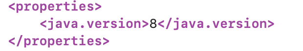
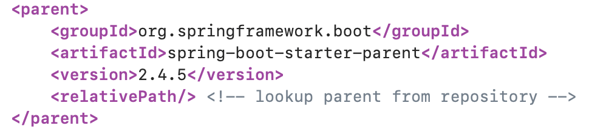

Исходя из эти данных, подберём образ для сборки бинарей:

`maven: 3.8-openjdk-8`

Также, видим, что в сервисе нет актуатора, `health-endpoint`. В dockerfile нужно внести `HEALTHCHECK`

### 1.3 Написание multi-stage dockerfile

Напишем Dockerfile для session service 

Разделим на два стейджа: 

- build - кеширование переменных, сборка бинарей
- runtime - сборка конечного docker-образа  

Dockerfile для session service: 

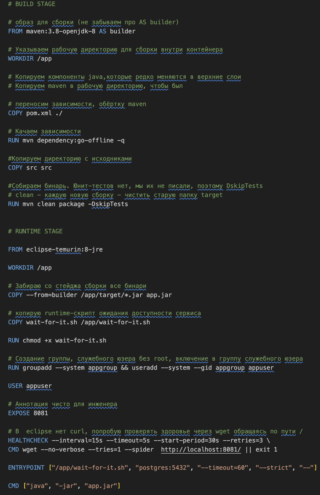

Кратко о build stage:

- Указываем в `Build stage` в разделе `FROM` пометку AS `builder`, чтобы в `Runtime stage` сработала строка `COPY --from=builder`
- Сначала копируем редко изменяемые зависимости в верхние слои, потом то, что меняется часто
- Если построен вменяемый `CI` или сервис уже обкатан по иному, есть резон указать `DskipTests` и скипнуть юнит-тесты
- Используем в `Runtime` `jre`- образ, где только нужные библиотеки и утилиты для запуска приложения
- Создаём сервисного `non-root` юзера и переводим на него работу приложения
- `HEALTHCHECK` обязан быть. `curl` в `jre`-образе нет, поэтому через `wget`
- Перед индексацией создаём `.dockerignore`
- Включаем в `ENTRYPOINT` скрипт ожидания сервиса `wait-for-it.sh`, чтобы контейнер падал не сразу, а дожидался сервисов `postgres`, `rabbitmq`

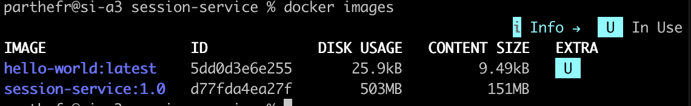

У нас вышло!

Проверим на `dockle`. Результат:

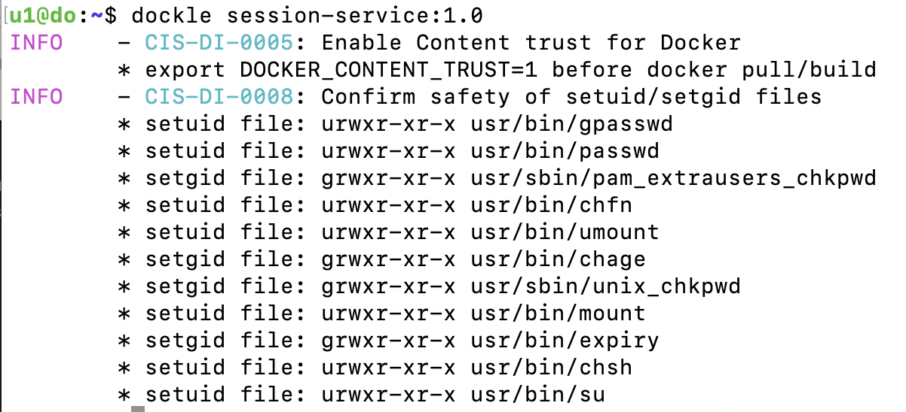

Ничего кроме `INFO` не получили. Отлично!

Из неожиданного:

Копирование зависимостей по типу mvnw, .mvn ломает сборку. `marven-wrapper.jar` лежит в виде `gif-lfs pointer`. Лежит только указатель. Когда-то `wrapper` был закомитчен через Git LFS и lfs-файлы не подтянулись. Использовали `mvn` из образа-сборщика

Запустим с учётом применения `wait-for-it.sh`

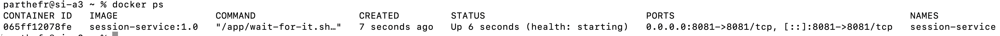

Как видим, теперь контейнер падает не сразу, а ждёт. Тоже результат.

Есть сервисы, которые ожидают два сервиса одновременно: `booking-service`, `report-service`
Чтобы не хардкодить в dockerfile, не указывапть `wait-for-it.sh` дважды просто напишем скрипт для автоматизации обращения `entrypoint.sh` и сделаем для кажого сервиса `.env`

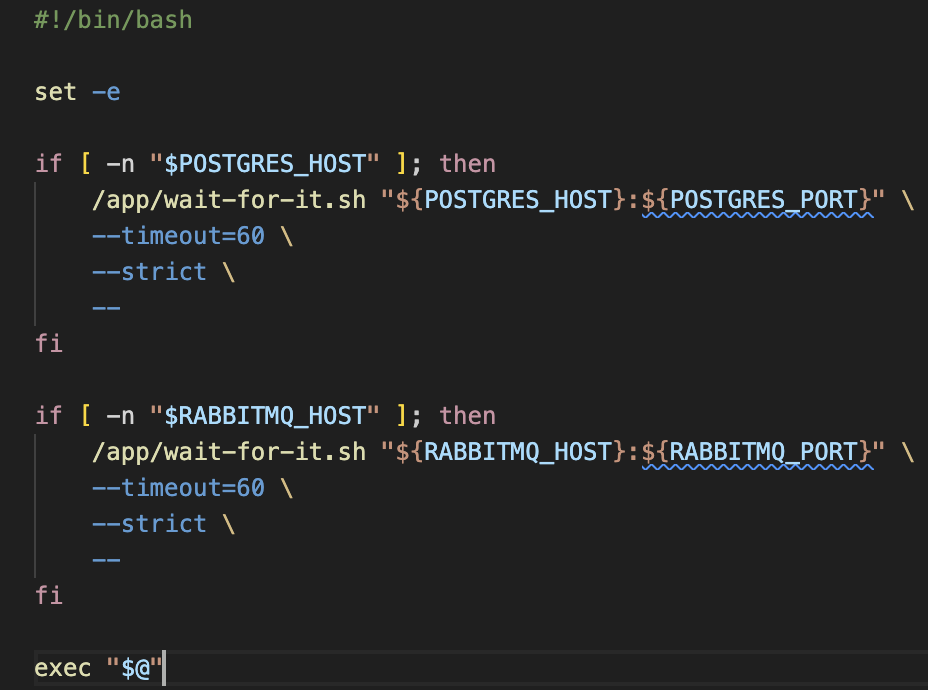

В `.env` укажем только нужные переменные, скрипт проделает работу за нас.
Единственное, необходимо в runtime копировать скрипт в образ, дать права на исполнение.
`Dockerfile` в итоге становится около типовым, его вид такой:

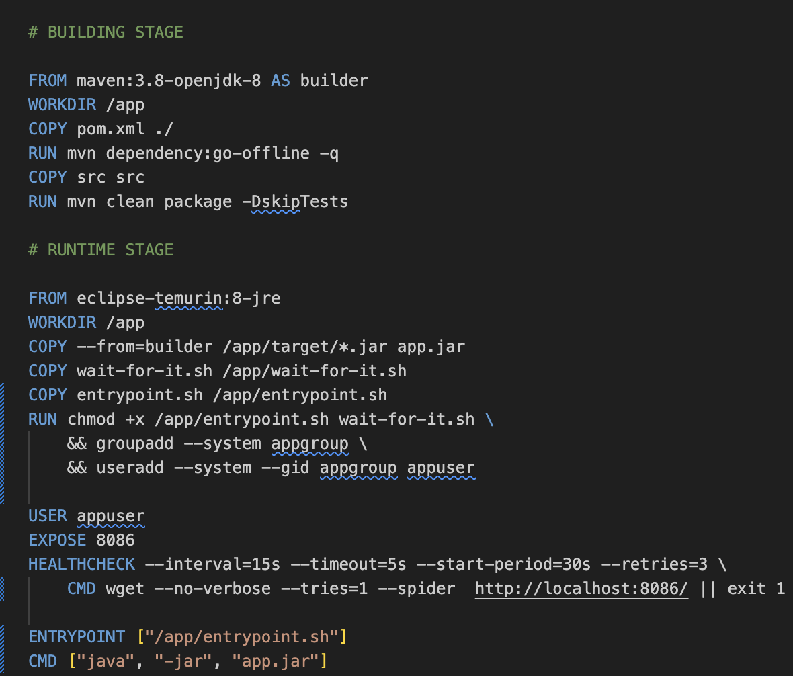

Важное по синтаксису команды сборки:

В Dockerfile мы указали относительные пути, посему, если не хотм бегать по папкам и запускать локально, помимо пути к `Dockerfile` мы должны указывать контекст
Синтаксис у команды такой:

`docker build -t [имя_образа:тег] -f ./путь_к_dockerfile ./путь_к_папке_с_сурсами`

Например:

`docker build -t gateway-service:1.0 -f ./gateway-service/Dockerfile ./gateway-service`

Мы собрали образы и даже в случае, если понадобиться пересобрать, сборка будет быстрой, поскольку зависимости закешированы в верхнем слое и не будут задеты

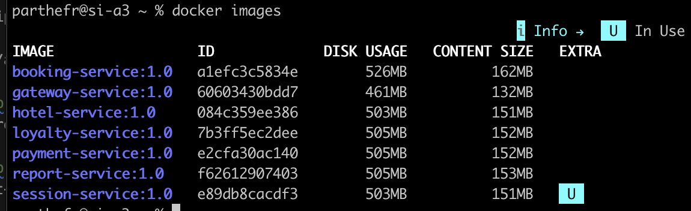

### 1.4 docker-compose

Разберём, как поднимаем инфраструткуру в `docker-compose.yaml`

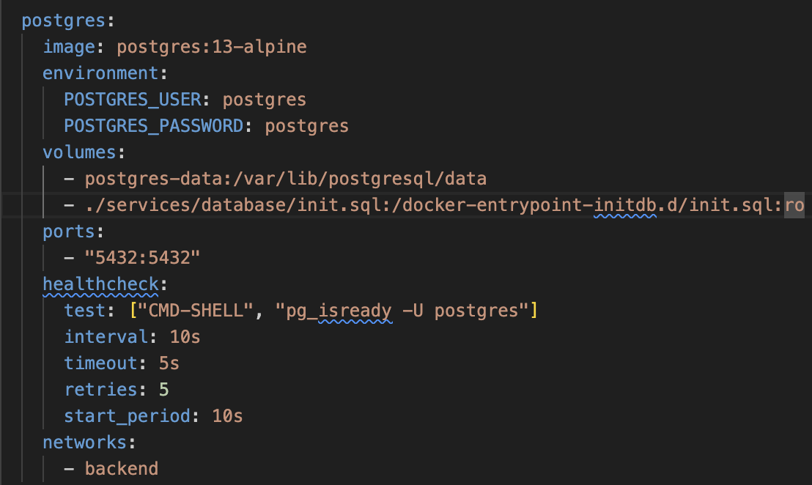

В поле `volumes` укажем:
- где будут хранится данные в случае, если docker падает:
`postgres-data:/var/lib/postgresql/data`
- где на хосте мы возьмём init.sql для первого включения postgreSQL:
`.services/database/init.sql:docker-entrypoint-initdb.d/init.sql:ro`
`ro`-read only
Важно: файл не копируется, просто создаётся связь между хостом и контейнером.

В `heathceck` внесём проверку готовности сервиса

Теперь рассмотри сервис:

Пройдёмся по `application.properties` и найдём все необходимые зависимости. Впишем их в `.env`, после сошлёмся в `docker-compose.yml` просто на том этого `.env`

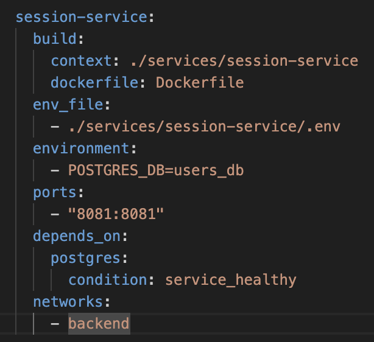

Здесь мы указываем:
- путь к общим `.env` с общими переменными для конкретного сервиса (взяли в `applicdtion.properties`)
- Конкретную базу данных для микросервиса
- конкретный порт контейнер:хост
- в поле depends_on указываем отслеживание состояния сервисa `postgres` (готовность)

Масштабируем на все сервисы.

***НУЖНЫЕ КОМАНДЫ***
- Запуск стека:  
`docker compose up -d --build`

- Проверка статуса:  
`docker compose ps`

- Смотр логов:  
`docker compose logs -f`

- Проверка heathchecks  
`docker inspect --format='{{State.Health.Status}}' [container_name]`

Запускаем стек:

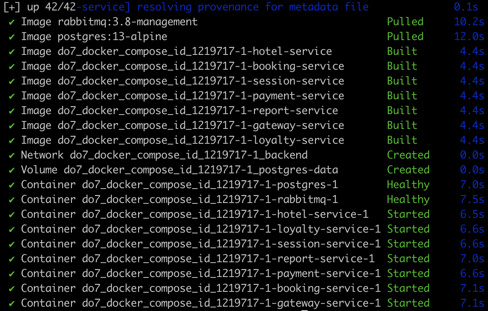

Видим:

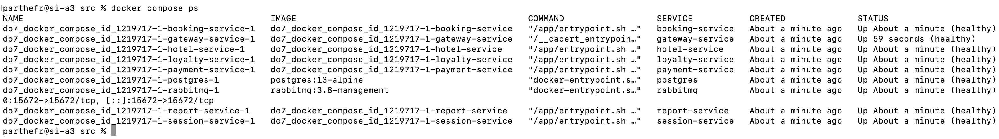

Проверяем постредством `Postman`

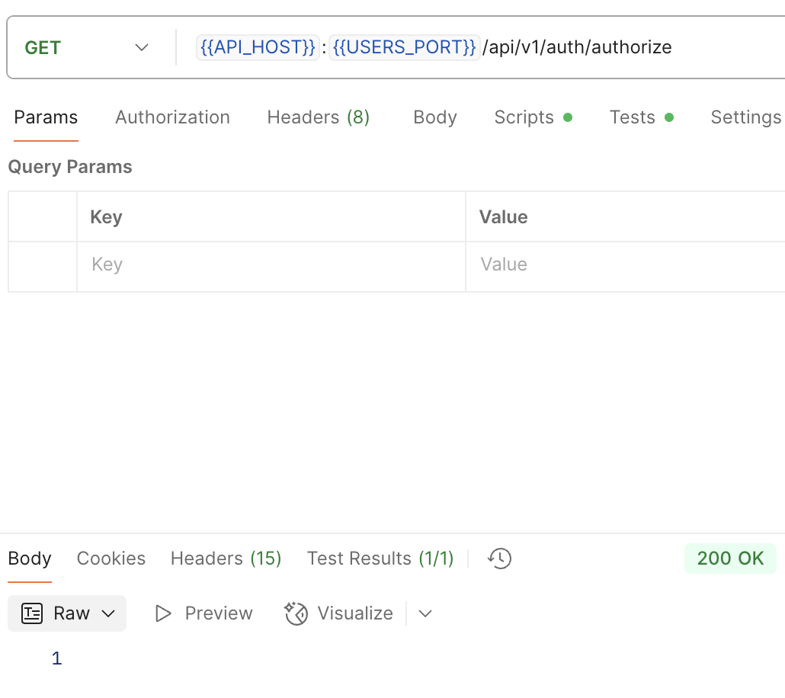

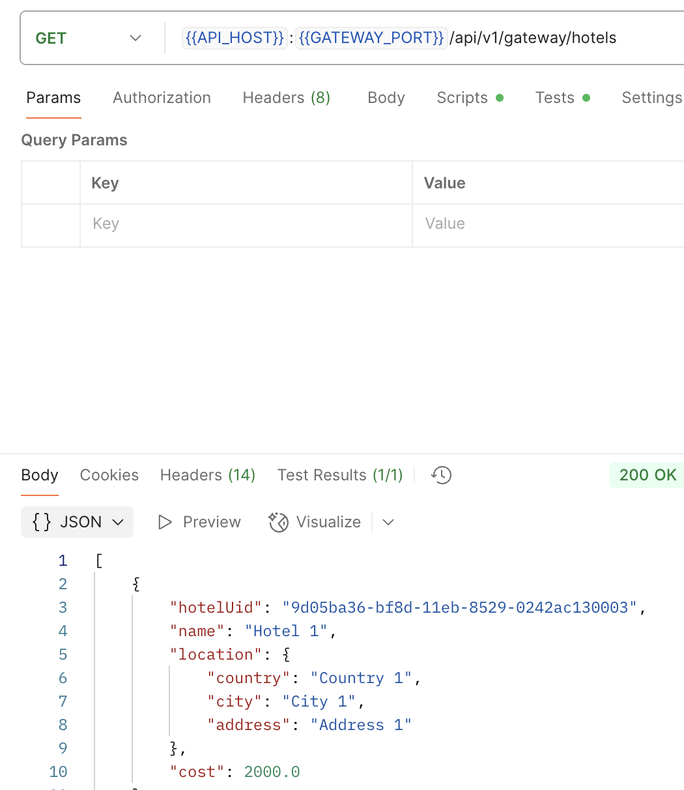

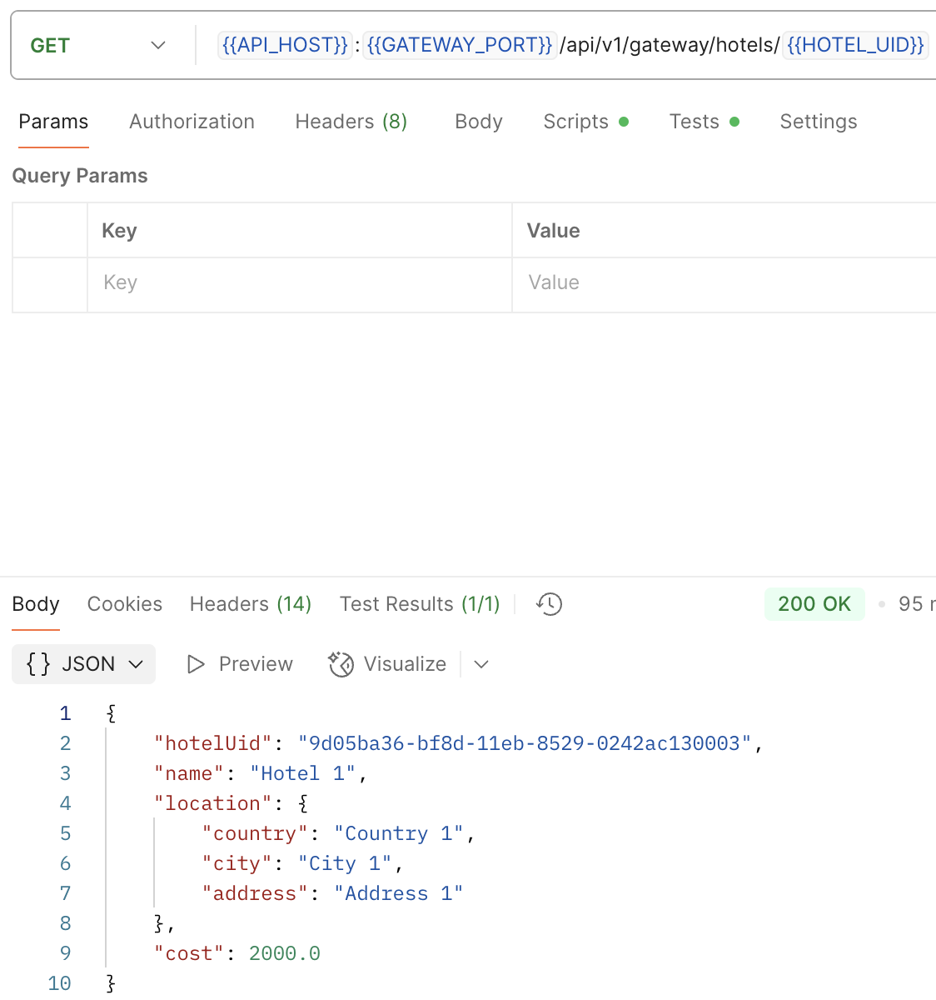

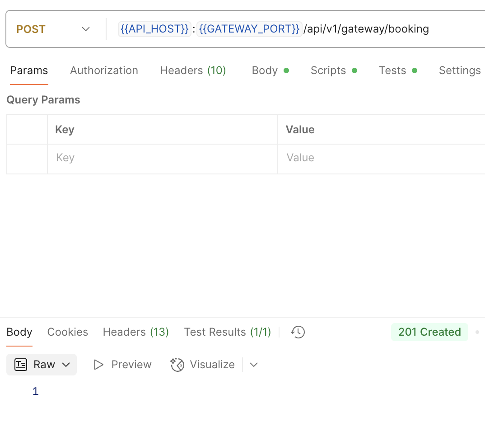

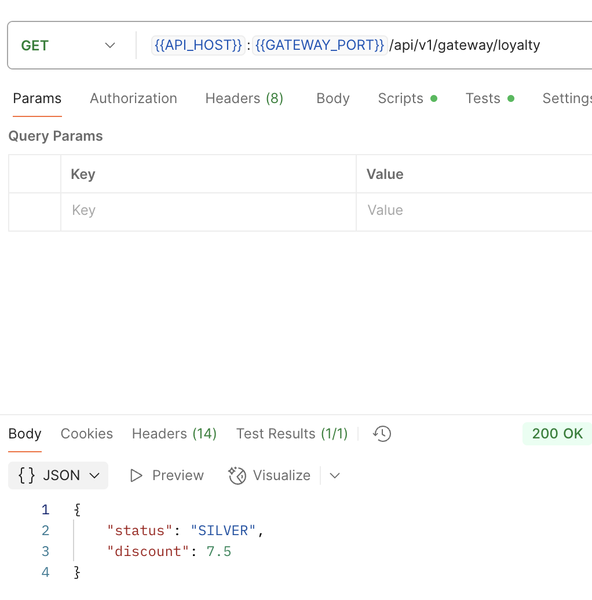

У нас получилось. Сервисы полностью работаспособны.

## Part 2. Создание виртуальных машин

Мы имеем дело с `vagrant`. Его цель-создание изолированной, посвторяемой и переносимой среды в виде виртуальной машины. Её мы конфигурируем также посредством принципов  `IaC` (декларативное конфигурирование инфраструктуры) в `Vagrantfile`
В качестве провайдера будем использовать `VirtualBox`

### 2.1 Декомпозиция

Разобъёем подготовку на несколько шагов:
1)  Выбор box-образа 
2) Написание Vagrantfile   
А, именно:
- Настройка ресурсов (CPU, RAM)
- Настройка сети 
- Настрока `Synced Fokder` (общая папка между хостом и вм)

### 2.2 Написание Vagrantfile

1) В качестве `box`-образа выберем  `ubuntu/jammy64` - ubuntu 22.04

2) Непосредственное написание

Мы не понимаем, сколько наш сервис ест ресурсов. Попробуем хотя бы примерно понять размер, заложим ресурс:

- запустим сервис: 
`docker compose up -d`

- запросим у `docker-compose` статистику:
`docer compose stats`

Видим:

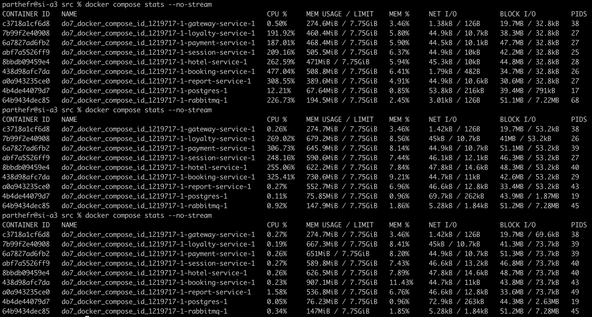

Что из этого можно извлечь:
- При старте на прогрев JVM уходит огромное количество ресурсов
- Java может очень много потреблять ресурсов, если её не ограничивать
- В конечно итоге, в простое приложения крайне непривередливы

Мы увидели, что суммарно, в моменте мы получили использование 18 логических ядер при 12 доступных, что абсурд.

Проведём небольшой тест. Ограничим внутри docker-compose.yml макимально доступные для сервисов ресурсы и посмотрим, приведёт ли это к OOMKILL или же нет. 

Модификацию рассмотрим на примере `session-service`

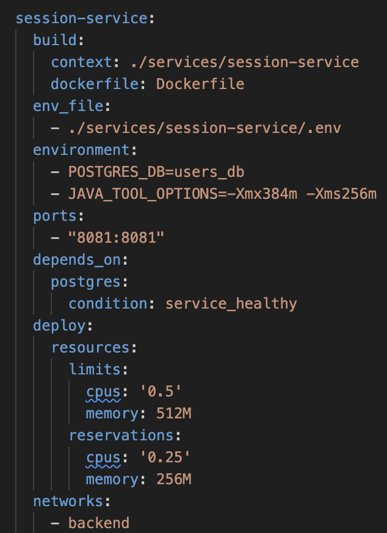

мы добавили поле `deploy` в котором ограничили минимальные и максимальные значения ресурсов.

Переменная `JAVA_TOOL_OPTIONS` нужна для автоматической передачи параметров в `JVM` и утилиты `JDK` без изменения командной строки запуска внутри `Dockerfile`

 Делаем так со всеми сервисами: 

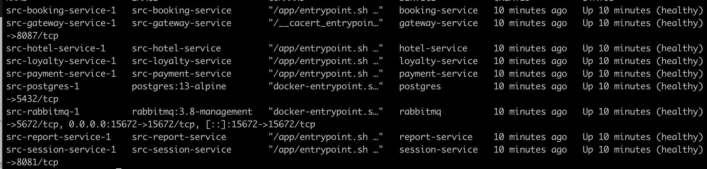

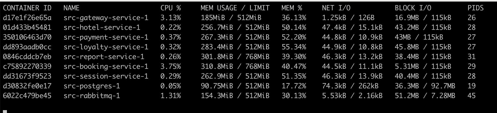

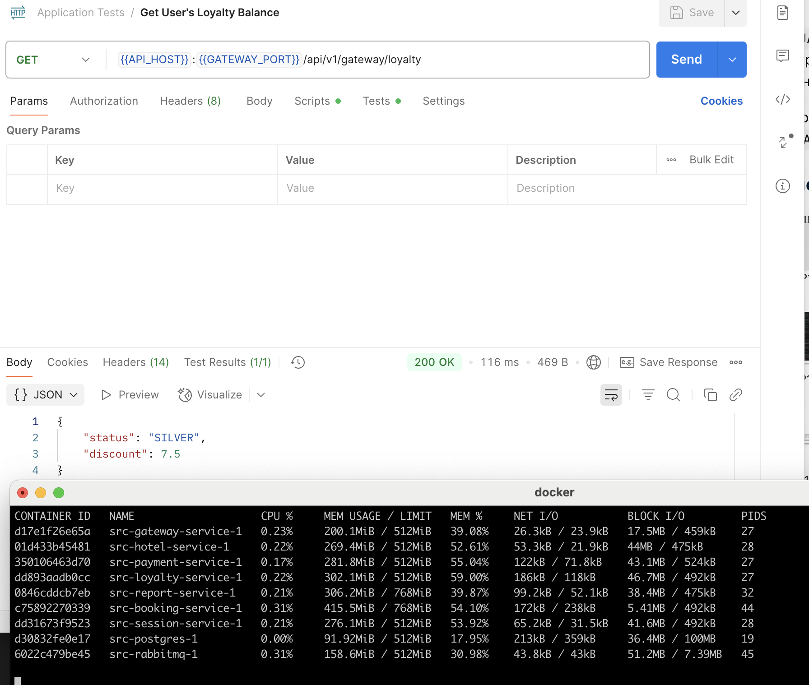

Даже с урезаными ресурсами контейнеры живы и работают.

Видим потребление под нагрузкой. В целом, можем ещё подрезать лемиты по RAM.

Порежем RAM на 30%, немного уменьшим  CPU

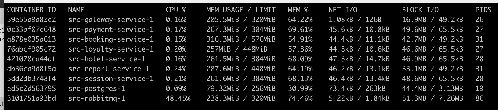

OOMKILL нет, конейнеры живы, тесты проходят

На основе полученных данных, сможем экономно законфигурировать воркеров, менеджера. 

Для выполнения второго задания достаточно просто поднять виртуалку и импортировать внутрь код.

- Создадим `Vagrantfile` рядом с `docker-compose.yml`

Перенесём в `goinfre` папки для создания машин, папку, куда `vagrant` складывает `vagrant box cache`

Перенесём папку с кешем через переменную окружения:

`export VAGRANT_HOME=/opt/goinfre/parthefr/.vagrant.d`

Проверим, что всё вышло:

`echo $VAGRANT_HOME`

Результат:

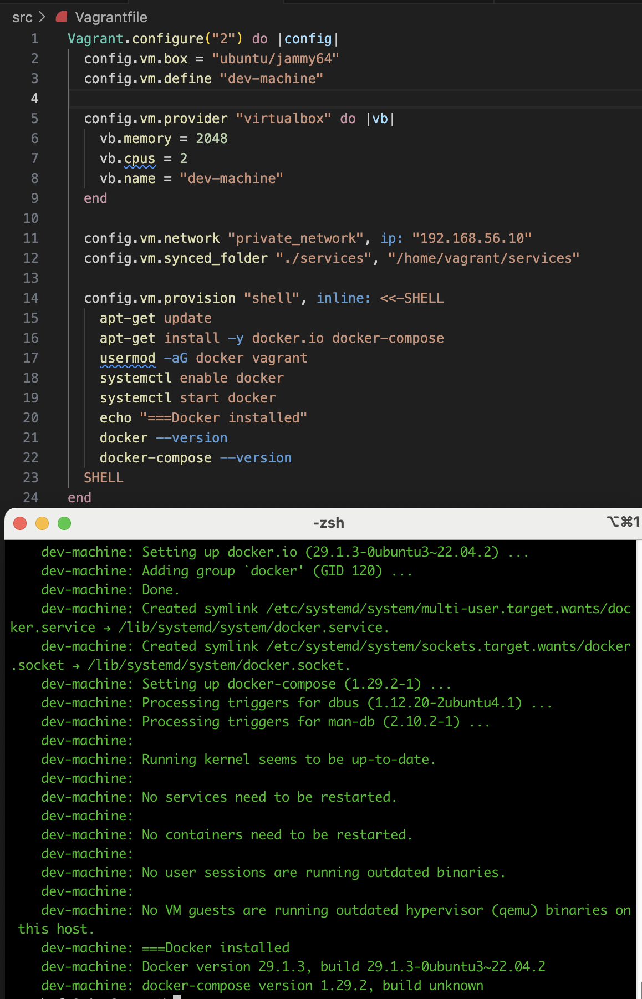

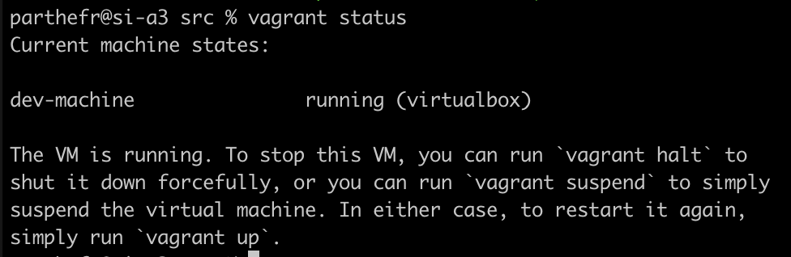

Vagrant передал публичный ключ на машину, передал приватный хосту. Подключаемся к машинке посредством `vagrant ssh`

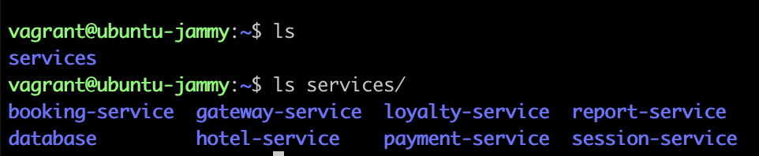

## Part 3. Создание простейшего Docker Swarm

### 3.1 Декомпозиция

Что от нас нужно:

- Написать `Vagranfile` для поднятия 3 машин (`manager01`, `worker01`, `worker02`)
- Проверить правильность поднятия
- Инициализировать `Docker Swarm` на `manager01`
- Подключить кластер
- Запушить оборазы в `Docker Hub`
- Задеплоить стек в `Swarm`
- Настроить `nginx proxy`
- Интегрировать `Portrainer` 

### 3.2 Поднятие машин

Эксперименты показали, что 2 ядра и 2 GB с головой хватит для нужд как менеджера, так и воркеров.

Перепишем `Vagrantfile`. Сделаем это в DRY-стиле. Установку docker на куждую машнку доверим скрипту `install-docker.sh`

Новый вариант `Vagrantfile`

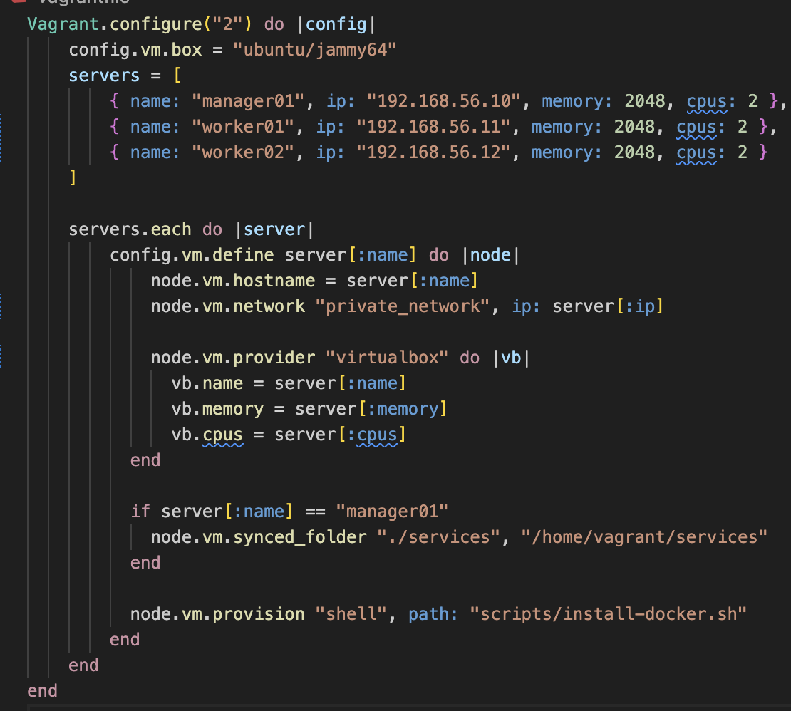

Здесь `config` - общие настройки для всех, `node` - для каждого из серверов по отдельности

В скрипте просто обновим, установим нужные зависимости, подтянем `GPG-ключ`, доваим `Docker-repository`, добавим пользователя `vagrant` в группу `docker`, создадим демона, проверим, что `docker` установлен успешно.

Не задудем сделать скрипт исполняемым:
`chmod +x ./scripts/install-docker.sh`

> Важный нюанс: мы не выделяем том под накопитель в `Vagrantfile`. Этот объём заложен в `box-образе`, который мы используем. По умолчанию, box `jimmy/64` резервирует под машину 20 GB. Естественно, тома динамические. 

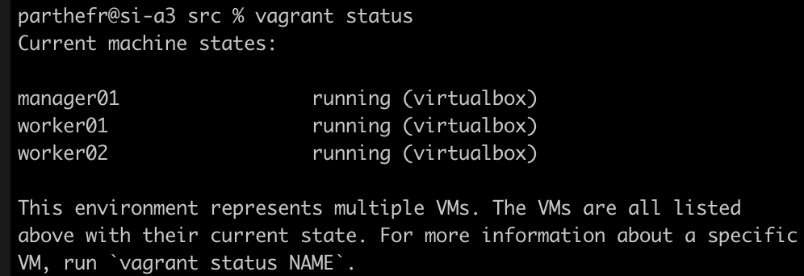

Как же мы хороши! 
Проверим связность и подключимся к каждой машнике:

Подключение: `vagrant shh [имя_машины]`

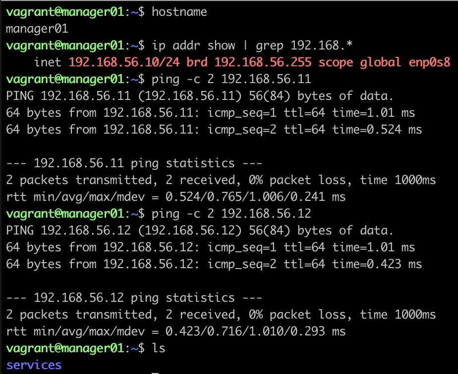

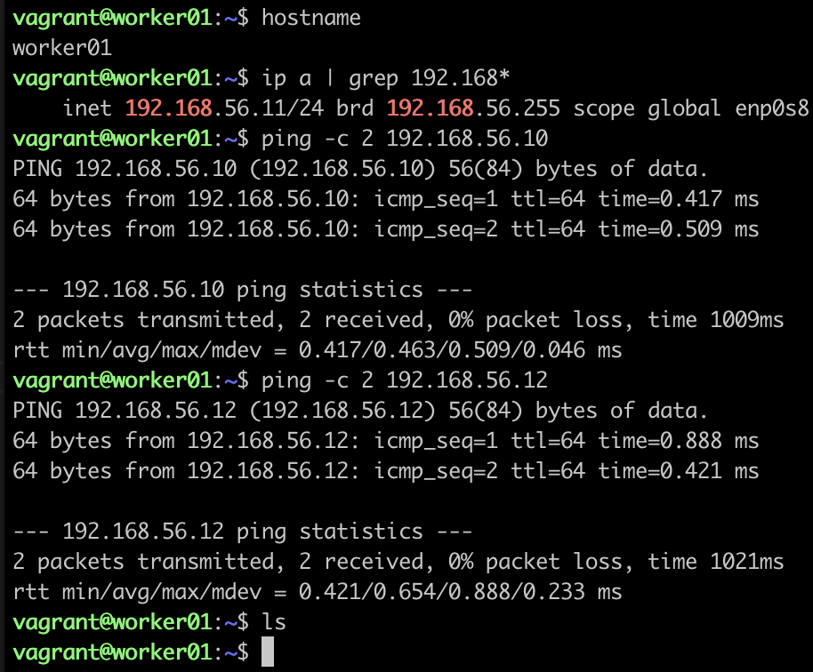

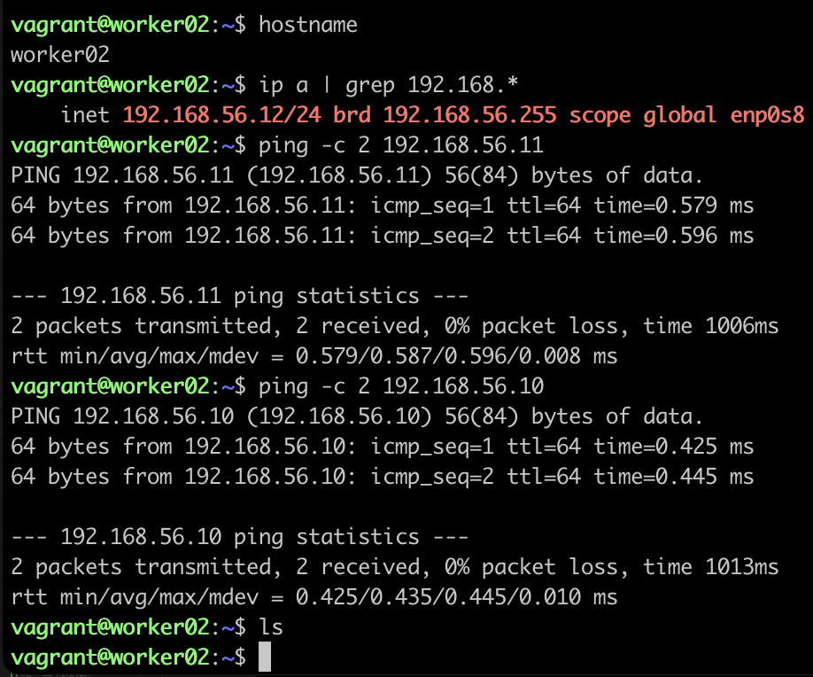

Связность наблюдается, адреса указаны верно6 сервисы скопированы.

### 3.3 Docker Swarm

Зачем нужен `manager01`, `worker01`, `worker02`?

manager: 
- хранение состояния, 
- планировщик задач,
- распределитель нагрузки между воркерами
- упраление воркерами
- принимает команды от пользователя  

worker01/02: 
- запуск контейнеров
- выполнение команд manager'a
- отчитыватся о статусе 

`Docker Swarm` делает с машинами ровно то же, что `kubernetes` с подами - создаёт между ними `overlay сеть`. 

`Overlay сеть` - виртуальная сеть поверх физической. Итог - разные машшины в одной сети, будто бы в loopback. 

Как происходит инициализация:
- `docker swarm init --advertise-addr 192.168.56.10` 
таким образом мы сделаем сервер с этим адресом - менеджером

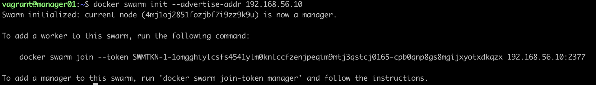

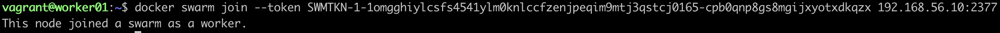

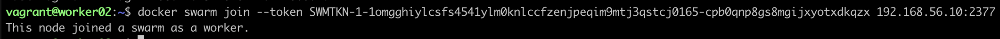

- После, с сервера-менеджера запросим токен для подключения воркера: `docker swarm join-token worker`

После, добавим каждого воркера. Взяв под контроль воркера, ввести команду:

- `docker swarm join --token` 

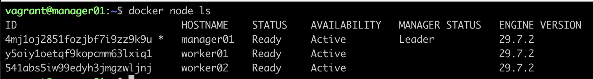

Мы - великолепны! Теперь перейдём к `Docker registry`

### 3.4 Docker registry

- Зарегистрируемся в `docker registry`. Тут объяснять не нужно
- Залогинимся на `manager01`

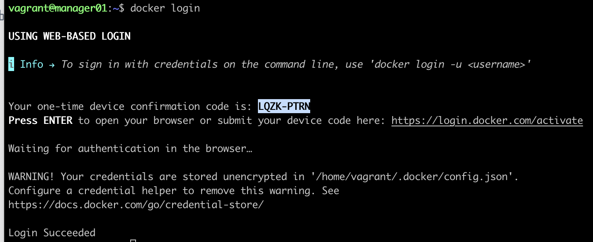

- Перетегируем в соответствии с практиками `docker registry`:

`docker tag <имя_образа>:<текущий_тег> <логин_в_Registry>/<имя_репозитория>:<новый_тег>`

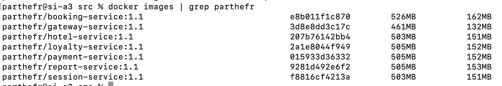

- Запушить образы: 

`docker push <логин_в_Registry>/<имя_репозитория>:<тег> `

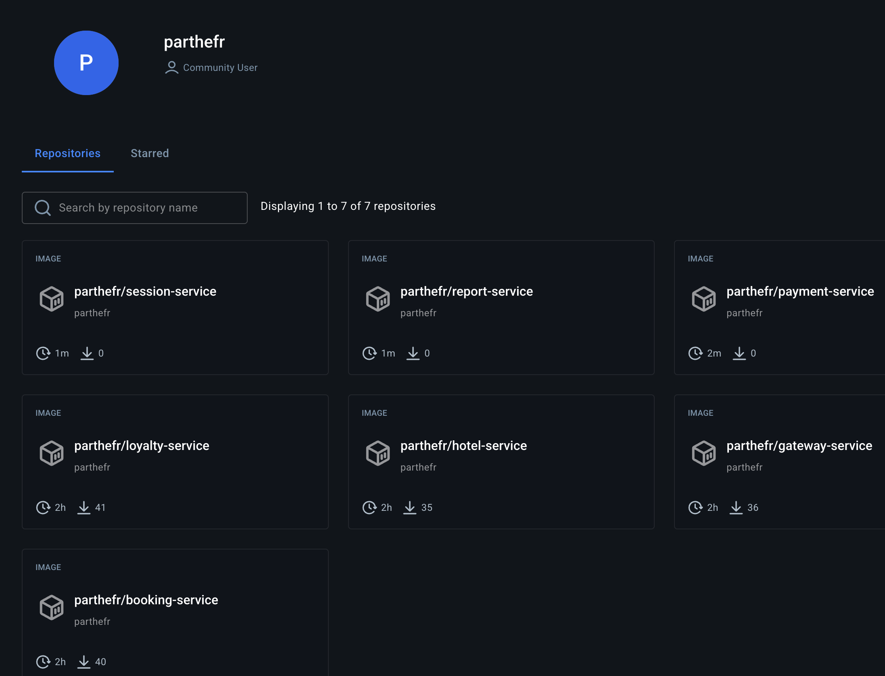

### 3.5 Docker-stack

Теперь перейдём к модификации `docker-compose.yml`, приведению структуры проекта к потребной, а именно:

- вынесем `.env` файлы в отдельную папку `deploy` для удобства применения `env_file`
- Составим `docker-stack.yml` на основе `docker-compose.yml`

Начнём с `.env` файлов. 

В томе `manager01` лежат сервисы. При помощи `bash`-команды перекопируем в `~/deploy/env/` файлы с переименованием. 

`find ./services -name ".env" | while read f; do cp "$f" ~/deploy/env/"$(basename $(dirname "$f")).env"; done`

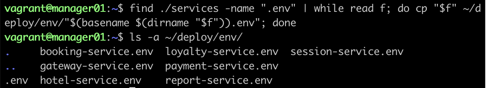

Вся модификация `.env`-файлов заключается в внесении в него `JAVA_OPTION_TOOL`, поля `POSTGRES_DB`

Пишем `docker-stack.yml`. Модифицируем `docker-compose.yml`, а именно:

- Убираем публичные порты (в оверлей сети не нужны, обращение напрямую к сервисам запрещено заданием)
- Убираем `depends_on` (не работает в `swarm`)
- Убираем `build` (уже есть образы)
- Указываем образы, загруженные в `Docker Hub`
- Монтируем `env_file`
- Указываем количество реплик в поле `deploy` (у нас всё по 1, можно было не делать)
- Меняем драйвер `bridge` на `overlay` в поле `networks`: `backend`: `driver`
- Добавляем `start_period` для `postgresql` , `rabbitmq` 10 и 30 секунд соответственно (а, что мешало сделать это раньше?!)

Теперь можно осуществить деплой.

- Перейдём в `manager01` 
- Перейдём в папку, где лежит `docker-stack.yml`
- `docker stack deploy -c docker-stack.yml hotelapp`

Процесс:

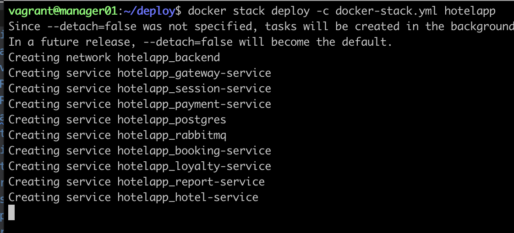

Результат:

`docker service ls`

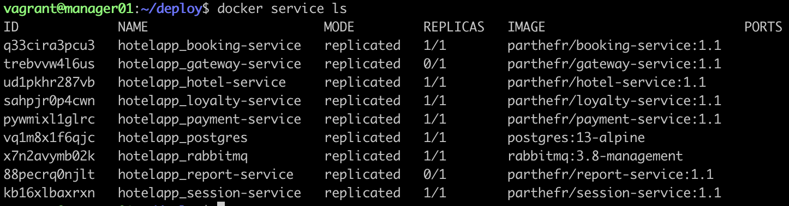

Как видим, умерло два контейнера.

Посмотрим, где и почему.

`docker stack ps hotelapp`

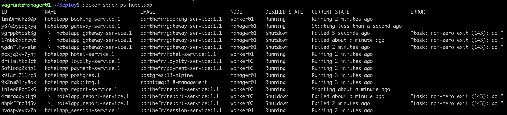

Видим, что приложение упало с кодом `143 (SIGTERM)`. Если бы это был `OOMKILL`, то был бы `137`. 

Посмотрим полный текст сообщения об ошибке:

`docker stack ps hotelapp --no-trunc`

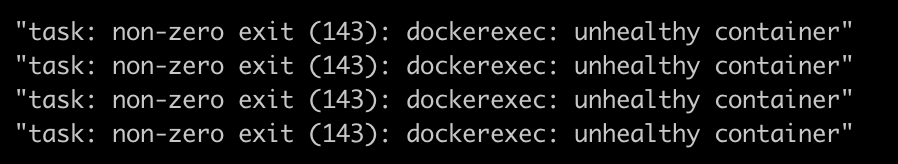

 Видим, что контейнер приболел и, что докер пытался его поднять 4 раза, после чего убил.  `swarm` не позволяет больным контейнерам висеть. Он их убиват.

Пойдём в воркера и посмотрим, как называется образ, который скачал воркер, какая `heathcheck` зашита в образ:

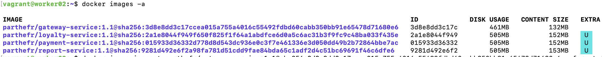

Поставим `jp`, если нет, пропишием:
`docker image inspect parthefr/gateway-service:1.1@sha256:3d8e8dd3c17ccea015a755a4016c55492fdbd60cabb350bb91e65478d71680e6 --format='{{json .Config.Healthcheck}}' | jq .`

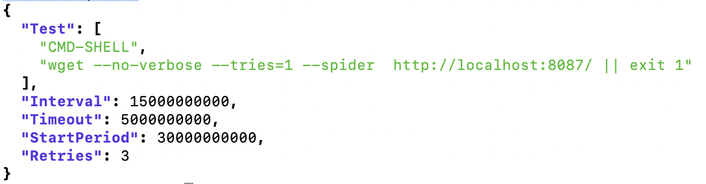

Если этот `entrypoint` даёт 404, значит переопределим его в `docker-stack.yml`

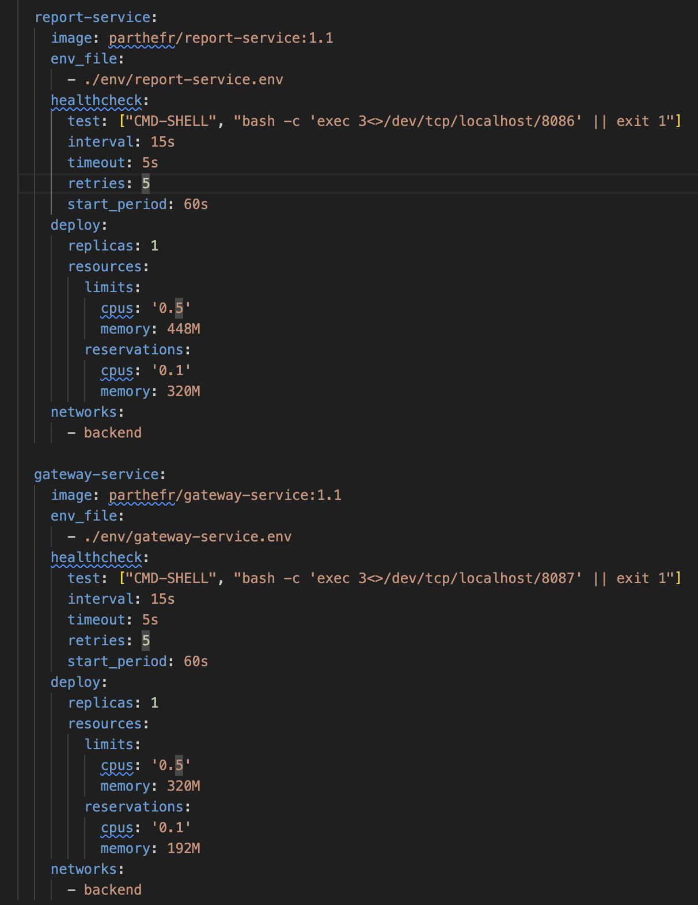

Я поменял проверку `HTTP` на `TCP`. Мне не стыдно

Обновим стек:

- `docker stack deploy -c docker-stack.yml hotelapp`

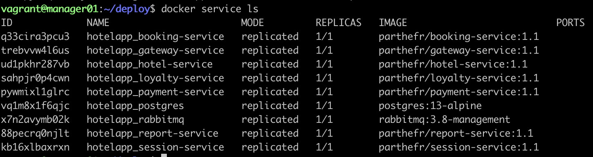

Мы великолепны!

### 3.6 Обратный прокси для сервиса

Необходимо включить nginx в ту же `overlay` сеть, что и сервис. В таком случае, он сможет резолвить `session-service` и `report-service` по именам (Docker Swarm DNS) без танцев с бубном.

- Создадим конфиг для nginx:

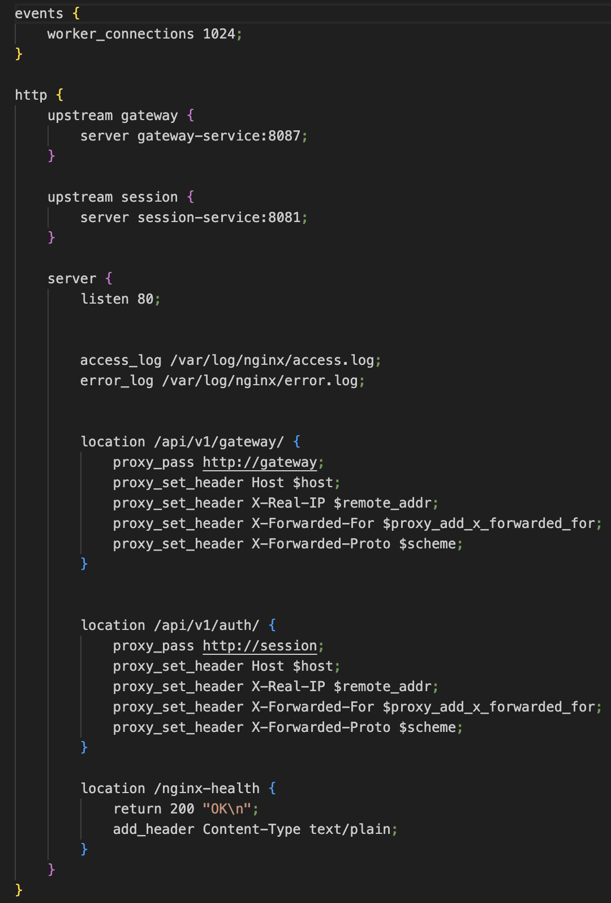

Прописываем для `session-service` и `report-service` маршруты.

- Добавим в `docker-stack.yml` сервис `nginx`

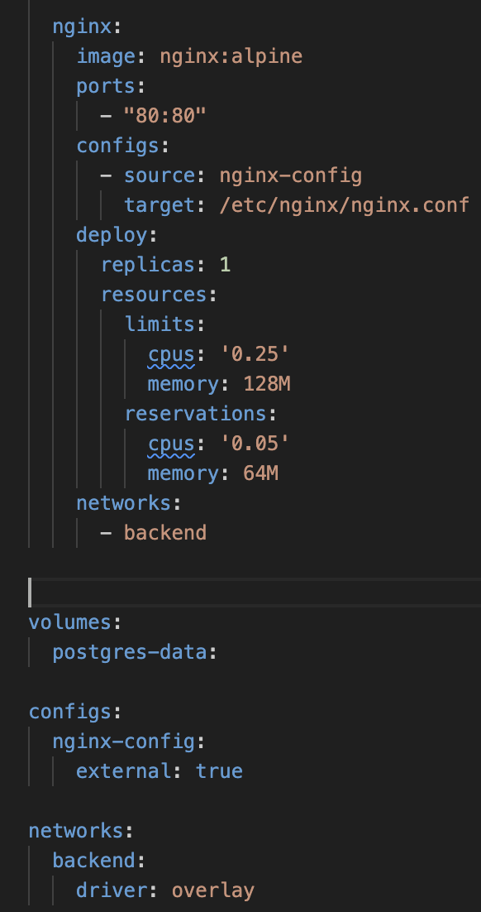

- Создадим `config`-файл, отправим на raft- хранилище:
`docker config create nginx-config nginx.conf`


> Что мы наделали?! Сделали конфиги общедоступными для всех участников стака. Теперь nginx может быть развёрнут там, где захочет `scheduler`. менеджера.

Задеплоим изменения:


Пробуем `curl` с разных нод кластера: 


Связность сохранна. 

Проверим с хоста, что достучаться напрямую к сервисам нельзя:


Пробуем `postman`


Видим, как распеределены ноды:

`docker stack ps hotelapp --format "table {{.Name}}\t{{.Node}}\t{{CurrentState}} | grep Running`


Мы великолепны! `Nginx` прекрасно проксирует трафик! `Swarm` самостоятельно перекидывает контейнеры туда, где есть ресурсы! 

### 3.7 Portainer 

У нас есть стек с сервисом. Установим отдельным стеком `Portainer` для визуализации управления и мониторинга. 

Для этого: 

- Написать отдельный `portainer-stack.yml` 
- Задеплоить стек
- Настроить стек
- Подключиться к сервису


Важное здесь: 

- `agent` `mode: global` - запускаем агент на каждом узле
- `portainer` зафиксирован на `manager01` 
- том `portainer-data` сохраняет настройки между перезапусками

Задеплоим стек:

`docker stack deploy -c portainer-stack.yml portainer`


Перейдём в веб-интерфейс и зарегистрируем пользователя admin:

`https://192.168.56.10:9443/#!/init/admin`

Получим: 


Получили таймаут безопасности. Мы не будем ждать.

`docker service update --force portainer_portainer`


Ура! Получилось!


Добавим `Docker Swarm`:


Провизуализируем:


Всё получилось! Помимо этого, есть возможность смотреть конфиги, детали сервисов, логи. В общем, имба! 

